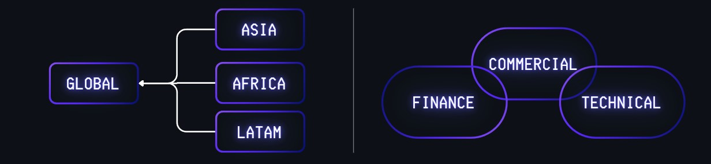
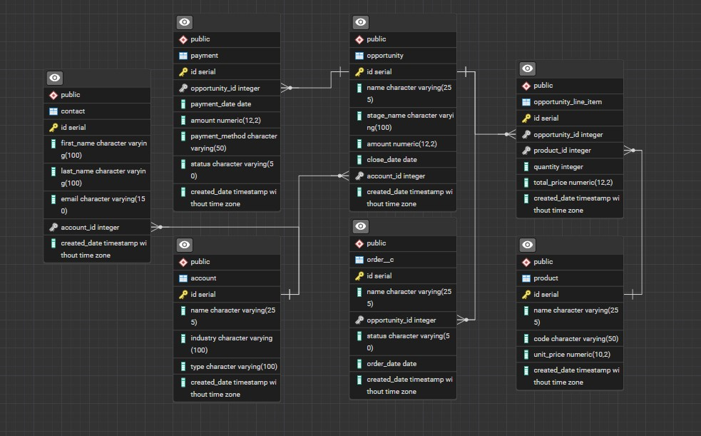
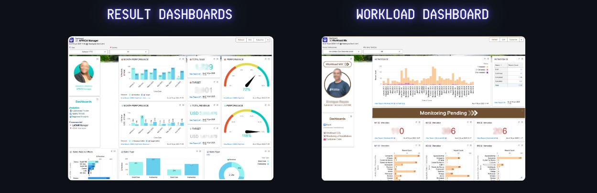
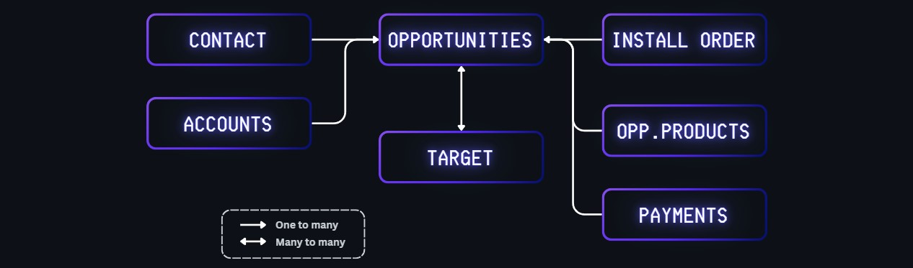
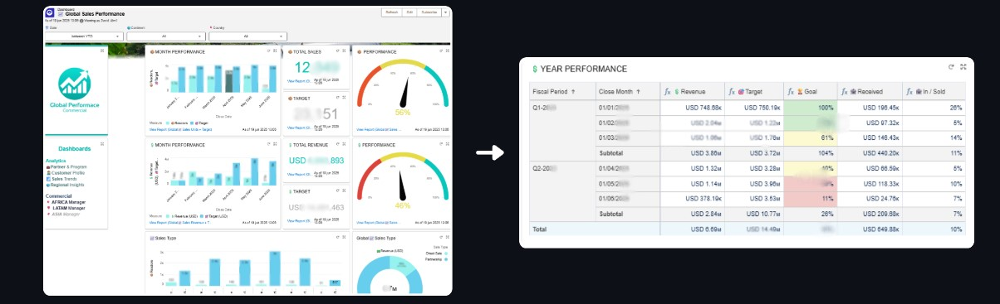
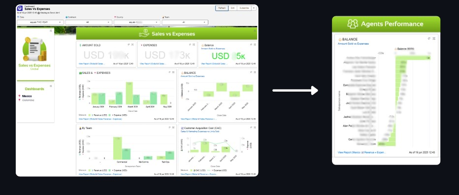
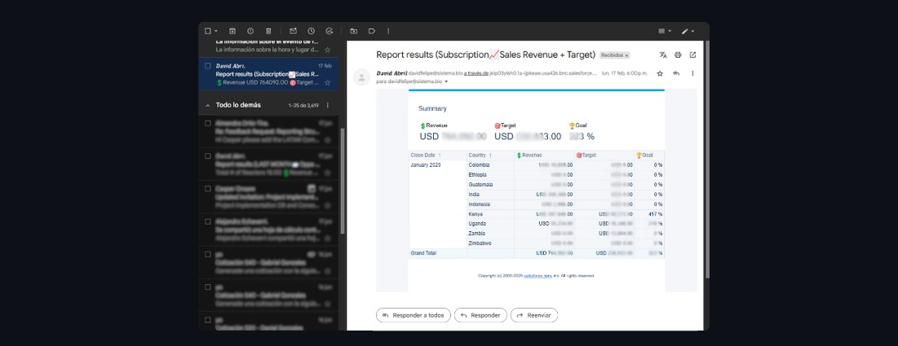
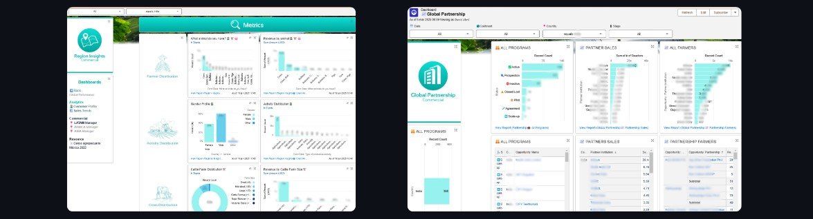
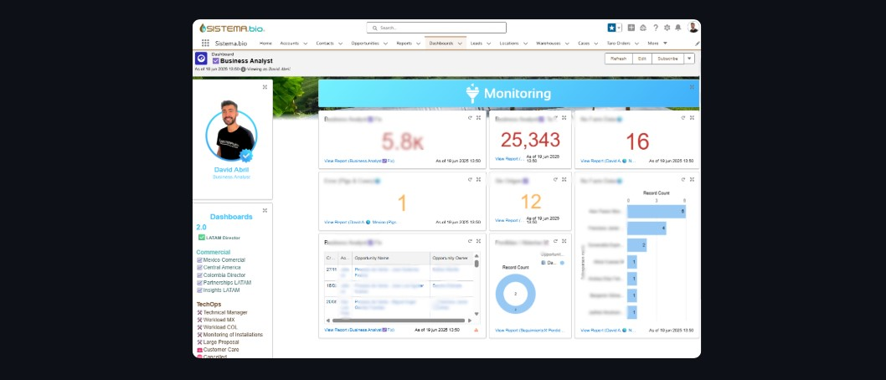

# 📊 Unified Salesforce Dashboard & Reporting System

This project documents the unified system of dashboards and reports I designed and implemented in Salesforce to centralize performance insights across multiple departments at Sistema.bio. It was built to improve visibility into sales performance, opportunity management, revenue tracking, agent profitability and the workload pending.

> ⚙️ **Tech Stack**: Salesforce (Reports, Dashboards, Custom Fields), SOQL, CRM Analytics, Data Modeling

---

## 🔍 Project Overview

The goal was to replace scattered, manual reporting processes with a unified system that could:

- Provide real-time performance dashboards to Commercial, Technical Operations, Finance, and Executive teams
- Enable filtering and segmentation by location, sales type, and agent.
- Automate core KPIs such as Sales Performance,Customer Acquisition Cost (CAC)
- Align reporting logic across sales lifecycle stages and business units

---

## 💼 Business Impact

| Area               | Impact                                                                 |
|--------------------|------------------------------------------------------------------------|
| Sales & CRM Teams  | Improved visibility into agent productivity and pipeline forecasting   |
| Finance Department | Automated profit vs. cost comparisons per period                       |
| Leadership         | Weekly reports and executive dashboards for decision-making            |
| Cross-Function     | Aligned definitions of KPIs across regions and reduced reporting time  |





---

## 📄 KPI Definitions

The unified reporting system was built around key business metrics critical to evaluating commercial performance across teams and regions. Below is a summary of the core KPIs:

| KPI Name                    | Description                                                                                  | Formula / Logic                                                                                   | Primary Use Case                                      |
|-----------------------------|----------------------------------------------------------------------------------------------|----------------------------------------------------------------------------------------------------|--------------------------------------------------------|
| 🎯 **Unit Performance**     | Measures actual units sold vs sales targets for the given period                            | `Units Sold / Unit Sales Target × 100`                                                             | Monitor sales goal attainment by agent or region       |
| 💰 **Revenue Performance**  | Compares payments received vs total value of closed-won opportunities                       | `SUM(Payments Received) / SUM(Opportunity Amount) × 100`                                           | Track realized revenue across time and products        |
| 👤 **Agent Performance**    | Calculates profitability by agent: total sales generated vs expenses incurred               | `SUM(Sales per Agent) - SUM(Commercial Expenses per Agent)`                                       | Evaluate agent profitability and efficiency            |
| 📉 **Customer Acquisition Cost (CAC)** | Measures average cost to acquire a customer by comparing sales expenses to new clients | `SUM(Commercial Expenses) / COUNT(New Customers)`                                                  | Assess cost-efficiency of sales operations             |

All KPIs were segmented by:
- ⏱️ **Time Period (monthly/quarterly)**
- 📍 **Location**
- 🧩 **Product Line**
- 🧑‍💼 **Sales Agent & Sales Type**

---

## 📐 Features

- 📈 **Multi-layer Dashboards**: By department, region, and product
- 🧮 **Custom KPIs**: e.g., Agent Profitability, Opportunity Conversion, Payment Progress
- 🧩 **Fact + Dimension Logic**: Unified model to describe accounts, opportunities, vendors

---

## 🛠️ Tools & Technologies

| Tool           | Usage                                                           |
|----------------|------------------------------------------------------------------|
| Salesforce     | Dashboards, Reports, SOQL Queries, Custom Fields                 |
| SOQL           | Data extraction and transformation across objects                |
| CRM Analytics  | Advanced dashboard customization               |
| Data Modeling  | Definition of core tables: Opportunities, Accounts, Payments     |

---


## 🧭 Dashboard Types

| Dashboard Type       | Focus Areas                                                                                                  | Example Metrics / Visuals                                                                                  | Primary Users                                     |
|----------------------|---------------------------------------------------------------------------------------------------------------|-------------------------------------------------------------------------------------------------------------|--------------------------------------------------|
| 📈 **Results**        | Business performance and strategic KPIs                                                                      | - Unit Sales vs Target<br>- Revenue Progress<br>- Agent Profitability<br>- Customer Acquisition Cost (CAC)       | Leadership, Finance, Commercial Managers,Technical Operations        |
| 📊 **Workload**       | Operational insights and agent activity tracking                                                              | - Opportunities with missing installation orders and payments<br>- Lead Follow-ups<br>- Pipeline Stages of the orders (Draft, Confirmed, Installed)   | - Sales Managers, Sales Agents, Technitians|



---

## 🧩 Architecture & Data Model

The dashboard system was based on a modular data model aligned with Salesforce's object schema. Key relationships:

- `Opportunity` ←→ `Account` ←→ `Opportunity_Product`  
- `Opportunity` ←→ `Payments` (custom object)
- `Opportunity` ←→ `Installation Orders` (custom object)  
- `Opportunity` ←→ `Owners`  




---

## 📸 Screenshots

## Performance Dashboard 

Metrics:  `Sales`, `Unit Performance`,`Revenue Performance`,`Products`

## Profitability Dashboard 

Metrics:  `Balance`, `Agent Performance`,`CAC`

## Automate Reporting 


## Partnership / Insights Dashboard 



## Workload Dashboard 



---

## 📌 Conclusions

The Unified Salesforce Dashboard & Reporting System delivered significant operational and strategic improvements across the organization:

- ✅ **Standardized Definitions of Sales and KPIs**  
  All departments now rely on consistent, aligned metrics — eliminating confusion and data misinterpretation.

- 🧭 **A Single Source of Truth for Reporting**  
  Dashboards became the centralized, authoritative source for performance tracking, accessible across teams.

- 📊 **No More Manual Consolidation**  
  Managers no longer need to manually consolidate data from different sources — all reports are automatically integrated.

- ⏳ **Time-Saving via Dynamic Filters**  
  There's no need to create new dashboards for every time period or location. Dashboards now support **real-time filtering** by date, region, agent, and more.

- 📡 **Real-Time Visibility Into Business Performance**  
  Leadership and operational teams can monitor sales, revenue, and agent performance live, allowing faster and more informed decisions.

- 🤝 **Improved Cross-Department Communication**  
  With shared dashboards and standardized metrics, all departments speak the same “data language,” improving collaboration and alignment.


---

## 📁 Repository Structure

```bash
.
├── README.md
├── images/
│   ├── dashboard-sales.png
│   └── dashboard-profitability.png
├── documentation/
│   └── data-model.md
├── queries/
│   ├── opportunity_metrics_soql.md
│   └── agent_profitability_formula.md
└── mock_data/
    ├── sample_opportunities.csv
    └── sample_payments.csv
